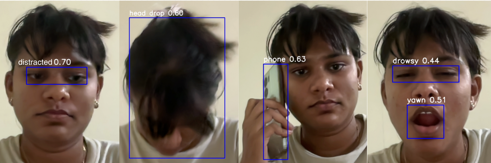

# AlertAI: Drowsiness & Distraction Detection System

AlertAI is a real-time monitoring system that detects signs of drowsiness, distraction, and other alertness issues using computer vision and provides audio alerts to prevent accidents.


## Features

- Real-time detection of:
  - Drowsiness
  - Head drops
  - Yawning
  - Distraction
  - On Phone
- Continuous monitoring through webcam
- Audio alerts when issues are detected consistently (not just momentary detections)
- Customizable alert thresholds
- Based on YOLOv8n object detection

## Requirements

- Python 3.6+
- OpenCV
- Ultralytics YOLOv8n
- gTTS (Google Text-to-Speech)
- A trained YOLOv8n model (e.g., `best.pt`)

## Installation

```bash
# Clone the repository
git clone https://github.com/Bhavisha-06/AlertAI.git
cd AlertAI

# Install dependencies
pip install -r requirements.txt
```

## Usage

1. The `best.pt` model file should be included in the repository
2. Run the detection script:

```bash
python alert_ai.py
```

3. To quit, press 'q' while the detection window is active

## Model File

The repository includes a trained YOLOv8 model file (`best.pt`) that detects drowsiness, head drops, yawning, and distraction. This model was trained on a custom dataset using Roboflow.

## Model Training

This project uses a custom YOLOv8 model trained on a drowsiness detection dataset. The model was trained using Roboflow and can identify the following classes:
- Drowsy
- Head drop
- Phone
- Yawn
- Distracted

## Project Structure

```
AlertAI/
├── alert_ai.py          # Main detection script
├── requirements.txt     # Dependencies
├── utils/
│   └── alert_utils.py   # Alert functionality
└── README.md            # This file
```

## License

MIT

## Contributing

Contributions are welcome! Please feel free to submit a Pull Request.
